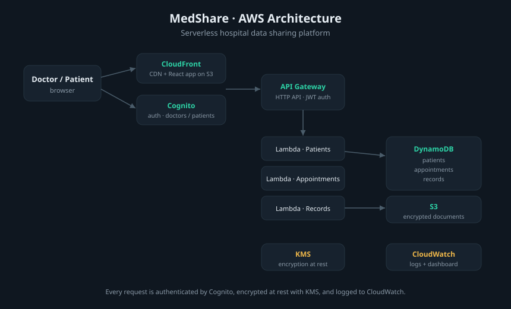
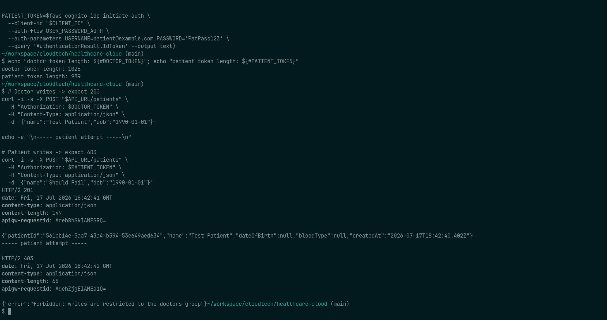
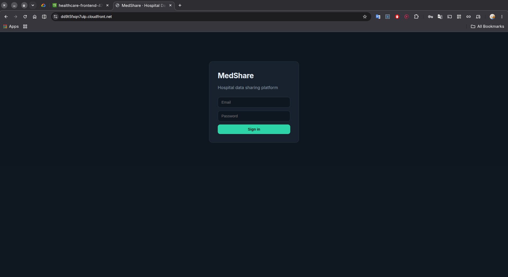
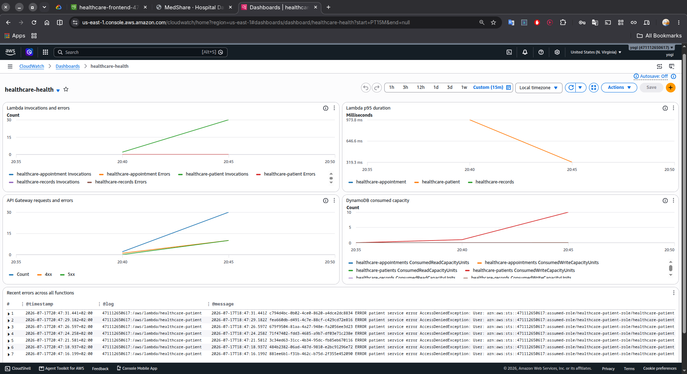

# Healthcare Management System on AWS

A serverless healthcare records platform built entirely with Terraform. Three
Lambda microservices behind an authenticated API, encrypted storage, per-service
IAM isolation, and a React frontend served from CloudFront.

Deploy with one command. Destroy with one command. Cost returns to zero.



## Why this exists

This started as a university assignment that asked for an architecture diagram.
A diagram proves nothing. This repository is the diagram, built, deployed, and
torn down on real AWS infrastructure, with every resource defined in code.

## Architecture

| Layer | Service | Purpose |
|---|---|---|
| Frontend | CloudFront + S3 | React app on a private bucket, reachable only through the CDN |
| API | API Gateway HTTP API | Routes requests, validates JWTs, throttles traffic |
| Auth | Cognito | User pool with `doctors` and `patients` groups |
| Compute | Lambda (Node.js 20) | Three microservices: patient, appointment, records |
| Data | DynamoDB | One table per service, pay-per-request |
| Documents | S3 | Medical files, uploaded through short-lived presigned URLs |
| Encryption | KMS | Customer-managed key, rotation enabled |
| Observability | CloudWatch + SNS | Alarms on function errors, duration, and throttles, on API 5xx, on DynamoDB throttling, and on AccessDenied events, plus a dashboard and structured access logs |
| State | S3 | Remote Terraform state with native locking |
| CI | GitHub Actions | Format, validate, and plan on every pull request |

## Proof of deployment

Deployed once on real AWS, captured, then destroyed. The Terraform is the durable
artifact; these show it running.

**Role-based authorization.** A doctor's token creates a record (`201`); a
patient's token is rejected on the same write (`403`). All three services enforce
this identically, reading the group from the verified JWT, not the request body.



**Frontend over CloudFront.** The React app served over TLS from a private S3
bucket reachable only through the CDN.



**Observability.** The CloudWatch dashboard after live traffic: Lambda
invocations and errors, p95 duration, API Gateway request and error counts, and
DynamoDB consumed capacity. The elevated 4xx line is the authorization layer
rejecting unauthorized writes.



## Security decisions

**Role-based writes.** Every route requires a valid Cognito JWT, so all access
is authenticated. Beyond that, write operations check the caller's
`cognito:groups` claim and allow only the `doctors` group to create records;
patients have read access. The group is read from the token API Gateway already
verified, not from the request body, so the check cannot be forged by the
client. Per-patient, row-level authorization is out of scope; see Scope.

**Per-service IAM roles.** Each Lambda has its own role, scoped to its own
DynamoDB table. The patient service cannot read appointment data. The
appointment service cannot touch medical documents. A compromised function gets
access to one table, not three.

**KMS via-service conditions.** The Lambdas hold `kms:Decrypt`, but a
`kms:ViaService` condition restricts it to calls arriving through DynamoDB and
S3. A compromised function cannot decrypt arbitrary ciphertext directly.

**No public bucket.** The frontend bucket blocks all public access. CloudFront
reaches it through Origin Access Control, and the bucket policy accepts requests
only from this specific distribution. There is no path to the objects that
bypasses the CDN.

**Scoped S3 prefixes.** The records service writes under `records/`. Its IAM
policy allows nothing outside that prefix.

**CORS locked to the distribution.** The API allows browser requests only from
the CloudFront domain, not `*`. A wildcard would let any website on the internet
call this API using a signed-in user's live session token.

**Access logs with user attribution.** Every API request logs the Cognito subject
claim of the caller. In a system holding patient health information, who accessed
what is an audit requirement.

**No stored CI credentials.** GitHub Actions authenticates to AWS through OIDC.
GitHub presents a signed token, AWS verifies it names this repository, and issues
credentials that expire in an hour. No access keys exist in GitHub secrets.

**No apply from CI.** The pipeline runs format, validate, and plan. It cannot
deploy, because the CI role has read-only permissions in AWS. Auto-deploying a
healthcare system on every merge is not a property worth having.

## Cost

Every service sits inside the AWS free tier at demo scale. The stack is destroyed
between demos, so the running cost is zero. The state bucket and lock file stay up
permanently and cost nothing when idle.

The API is throttled at 50 requests per second sustained, 100 burst. That caps
blast radius on a runaway loop as much as it protects the backend.

## Deploy

Prerequisites: AWS CLI configured, Terraform 1.10 or later, Node.js 20 or later.

### One-time backend setup

Creates the state bucket and the GitHub Actions role.

```bash
cd terraform/bootstrap
cp terraform.tfvars.example terraform.tfvars   # set github_repo
terraform init
terraform apply
```

Copy the `state_bucket` output into the `backend "s3"` block in `terraform/main.tf`.

### Deploy the stack

```bash
cp terraform/terraform.tfvars.example terraform/terraform.tfvars   # set alert_email
./deploy.sh
```

This provisions the infrastructure, writes `frontend/.env` from the Terraform
outputs, builds the React app, syncs it to S3, and invalidates the CloudFront
cache. The frontend URL prints at the end.

### Create a user

```bash
./create-user.sh doctor@example.com YourPass123 doctors
```

### Destroy

```bash
./destroy.sh
```

Confirm the SNS subscription in your email after the first apply, or the alarms
will not notify you.

## Repository layout

```
terraform/
  main.tf          Provider, backend, common tags
  variables.tf     Inputs
  auth.tf          Cognito user pool and groups
  data.tf          DynamoDB tables, S3 documents bucket, KMS key
  iam.tf           Three per-service Lambda execution roles
  lambda.tf        Function definitions and packaging
  api.tf           HTTP API, Cognito authorizer, routes, access logs
  monitoring.tf    Alarms, log groups, metric filters, dashboard
  frontend.tf      CloudFront distribution and private S3 bucket
  outputs.tf       Deploy outputs
  bootstrap/       State bucket and GitHub Actions OIDC role. Run once.

lambda/
  patient/         Patient CRUD
  appointment/     Appointment scheduling
  records/         Medical records and presigned document uploads

frontend/          React 18, Vite, Cognito auth
```

## Scope

This is not a HIPAA-compliant production system. HIPAA requires a signed AWS
Business Associate Addendum, organizational safeguards, and audit controls beyond
what application code provides. The architecture demonstrates the technical
controls a compliant system would build on: encryption at rest and in transit,
least-privilege access, and an audit trail.

Authorization is role-based, not row-level: the `doctors` group can write and any
authenticated user can read. Scoping each patient to only their own records would
build on this by deriving the owner from the token's `sub` claim and querying a
per-patient index. That is a deliberate next step, not a shipped feature.